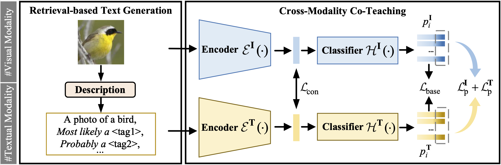

# Textual Knowledge Matters: Cross-Modality Co-Teaching for Generalized Visual Class Discovery


<p align="center">
    <a href="https://www.ecva.net/papers/eccv_2024/papers_ECCV/html/6840_ECCV_2024_paper.php"></a>
    <a href="https://arxiv.org/abs/2403.07369"></a>
  <a href="https://github.com/CVMI-Lab/SlotCon/blob/master/LICENSE"></a>
</p>
<p align="center">
	Textual Knowledge Matters: Cross-Modality Co-Teaching for Generalized Visual Class Discovery<br>
</p>



In this paper, we study the problem of Generalized Category Discovery (GCD), which aims to cluster unlabeled data from both known and unknown categories using the knowledge of labeled data from known categories. Current GCD methods rely on only visual cues, which however neglect the multi-modality perceptive nature of human cognitive processes in discovering novel visual categories. To address this, we propose a two-phase TextGCD framework to accomplish multi-modality GCD by exploiting powerful Visual-Language Models. TextGCD mainly includes a retrieval-based text generation (RTG) phase and a crossmodality co-teaching (CCT) phase. First, RTG constructs a visual lexicon using category tags from diverse datasets and attributes from Large Language Models, generating descriptive texts for images in a retrieval manner. Second, CCT leverages disparities between textual and visual modalities to foster mutual learning, thereby enhancing visual GCD. In addition, we design an adaptive class aligning strategy to ensure the alignment of category perceptions between modalities as well as a softvoting mechanism to integrate multi-modality cues. Experiments on eight datasets show the large superiority of our approach over state-of-the-art methods. Notably, our approach outperforms the best competitor, by 7.7% and 10.8% in All accuracy on ImageNet-1k and CUB, respectively.

## Running

### Dependencies

```
pip install -r requirements.txt
```

### Config

Set paths to datasets and desired log directories in ```config.py```


### Datasets

We use fine-grained benchmarks in this paper, including:

* [The Semantic Shift Benchmark (SSB)](https://github.com/sgvaze/osr_closed_set_all_you_need#ssb)

We also use generic object recognition datasets, including:

* [CIFAR-10/100](https://pytorch.org/vision/stable/datasets.html) and [ImageNet-100/1K](https://image-net.org/download.php)


### Scripts

**Train the model**:

```
mkdir retrieved_text
bash scripts/train_${DATASET_NAME}.sh
```

## Results
Our results:

| Datasets      | Paper (3runs)                  | Current Github (5 runs)                                      |
| ------------- | ------------------------------ | ------------------------------------------------------------ |
| Cifar100      | All 85.7 / Old 86.3 / New 84.6 | seed0: All 0.8548 / Old 0.8509 / New 0.8626 <br />seed1: All 0.8408 / Old 0.8557 / New 0.8110<br />seed2: All 0.8531 / Old 0.8630 / New 0.8333<br />seed3: All 0.8638 / Old 0.8629 / New 0.8656<br />seed4: All 0.8604 / Old 0.8642 / New 0.8526<br />average: All 85.46±0.88 / Old 85.93±0.58 / New 84.50±2.28 |
| Cifar10       | All 98.2 / Old 98.0 / New 98.6 | seed0: All 0.9850 / Old 0.9789 / New 0.9881 <br />seed1: All 0.9848 / Old 0.9814 / New 0.9864<br />seed2: All 0.9850 / Old 0.9792 / New 0.9878<br />seed3: All 0.9849 / Old 0.9785 / New 0.9881<br />seed4: All 0.9849 / Old 0.9768 / New 0.9889<br />average: All 98.49±0.01 / Old 97.90±0.17 / New 98.79±0.09 |
| CUB           | All 76.6 / Old 80.6 / New 74.7 | seed0: All 0.7776 / Old 0.7872 / New 0.7728 <br />seed1: All 0.7669 / Old 0.7585 / New 0.7711<br />seed2: All 0.7791 / Old 0.8099 / New 0.7638<br />seed3: All 0.7667 / Old 0.7772 / New 0.7614<br />seed4: All 0.7729 / Old 0.7632 / New 0.7778<br />average: 77.26±0.58 / Old 77.92±2.06 / New 76.94±0.67 |
| Stanford Cars | All 86.9 / Old 87.4 / New 86.7 | seed0: All 0.8556 / Old 0.9195 / New 0.8248<br />seed1: All 0.8547 / Old 0.9220 / New 0.8221<br />seed2: All 0.8652 / Old 0.9180 / New 0.8397<br />seed3: All 0.8548 / Old 0.9100 / New 0.8281<br />seed4: All 0.8752 / Old 0.9180 / New 0.8545<br />average: All 86.11±0.90 / Old 91.75±0.45 / New 83.38±1.34 |
| Oxford Pets   | All 95.5 / Old 93.9 / New 96.4 | seed0: All 0.9368 / Old 0.9332 / New 0.9387<br />seed1: All 0.9434 / Old 0.9109 / New 0.9604<br />seed2: All 0.9529 / Old 0.9396 / New 0.9599<br />seed3: All 0.9459 / Old 0.9290 / New 0.9549<br />seed4: All 0.9496 / Old 0.9321 / New 0.9588<br />average: 94.57±0.62 / Old 92.90±1.08 / New 95.45±0.91 |
| Flowers 102   | All 87.2 / Old 90.7 / New 85.4 | seed0: All 0.8418 / Old 0.9412 / New 0.7922<br />seed1: All 0.9059 / Old 0.9255 / New 0.8961<br />seed2: All 0.8850 / Old 0.9137 / New 0.8706<br />seed3: All 0.8810 / Old 0.9373 / New 0.8529<br />seed4: All 0.8850 / Old 0.9451 / New 0.8549<br />average: All 87.97±2.33 / Old 93.26±1.28 / New 85.33±3.83 |

## Citing this work

If you find this repo useful for your research, please consider citing our paper:

```
@article{zheng2024textual,
  title={Textual Knowledge Matters: Cross-Modality Co-Teaching for Generalized Visual Class Discovery},
  author={Zheng, Haiyang and Pu, Nan and Li, Wenjing and Sebe, Nicu and Zhong, Zhun},
  journal={arXiv preprint arXiv:2403.07369},
  year={2024}
}
```

## Acknowledgements
Our lexicon is based on the LENS project, with thanks to the resources available at [LENS](https://github.com/ContextualAI/lens). Our codebase also heavily relies on [SimGCD](https://github.com/CVMI-Lab/SimGCD). Thanks for their excellent work!

## License

This project is licensed under the MIT License - see the [LICENSE](LICENSE) file for details.
